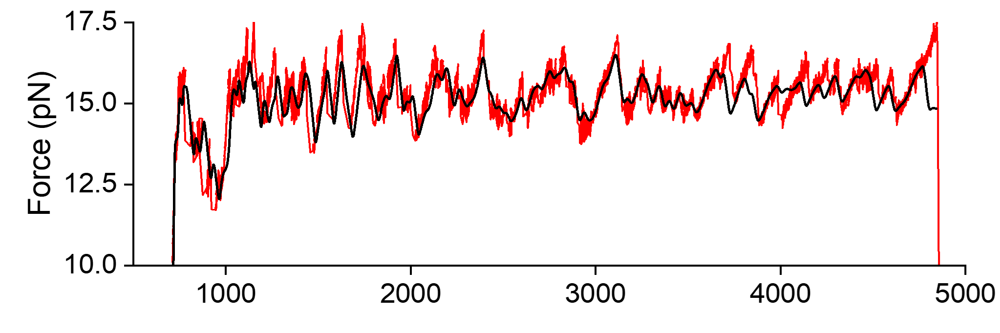
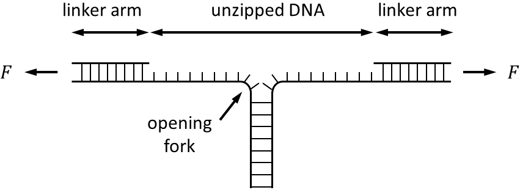

# DNA Unzipping Curve Calculator (GPU version)  

This is a learning project and my first time using CUDA. It runs pretty fast and can finish the whole *E.coli*  genome in about a minute (my GPU: GeForce RTX 3070 Laptop).  

## Instructions to Use (with Example Data)  

1. The example genome is NEB H5alpha, the genbank file is in "examples" folder.  
2. Run **parse_h5alpha.py** to parse the *200304_NEB_H5alpha_genbank.txt* and *200304_NEB_H5alpha.txt* to individual files. These files should be saved in folder "parsed"  
3. Build the project on Windows. This .bat file will automatically run a test using the sequences in folder "parse"  

```bash
> src/build.bat
```
To batch-process sequence files in your own folder, use this command  

```bash
> main path/to/your/own/folder
```

Result:  



**DNA unzipping experiment vs theory**. The prediction (black) aligns well with a single-molecule experimental data (blue).  

## Why CUDA  

Single-molecule approaches such as optical tweezers, etc. can unzip a single dsDNA at single-molecular level.



 a theoretical prediction of unzipping forces can be calculated from partition functin of the system. The partition function $Z$ at a total extension of the system $z$ is

$$Z(z) = \sum_{j=0}^{j_{max}}e^{-G(j,z)/kT}$$

The force $F$ is

$$F(z) = -kT\frac{\partial }{\partial z}\mathrm{ln}Z$$

To calculate the force-extension curve, we need to obtain the energy $G(j,z)$ at each j and z. The calculation of $G(j,z)$ is time-consuming and the scales of j and z are large (usually in a range of 1,000-10,000). Therefore, GPU is a good choice for this problem. This GPU version program is much faster than conventional program (> 10,000 times faster), and 10x faster than my previous, highly-optimized [CPU version](https://github.com/Taomihog/unzipDNA_CPU).

## Further Reading  

[1] Essevaz-Roulet, Baptiste, Ulrich Bockelmann, and Francois Heslot. (1997) PNAS  
[2] Bockelmann, Ulrich, et al. (2002) Biophysical journal  
[3] Huguet, Josep M., et al. (2010) PNAS  
